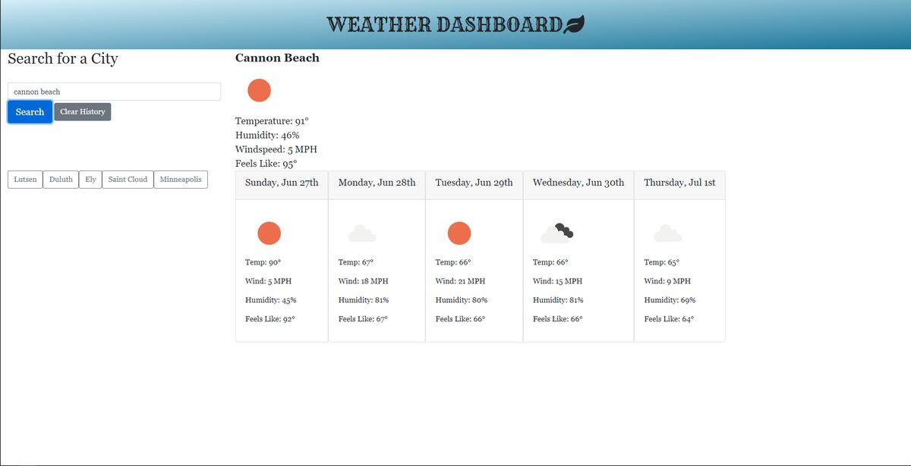

# Weather Dashboard
## Description
This is a weather dashboard page that allows the user to search for a city and see it's current weather attributes and a five-day forecast. It saves recent searches for convenient callbacks to places of interest. In addition to the locations themselves, the weather information is also saved to local storage in case API calls fail.

## Screenshot

Check out the [deployed web page](https://neilburt.github.io/weather-dashboard/).
